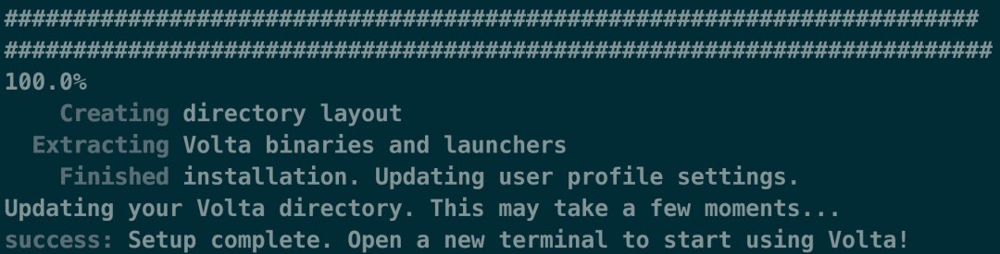
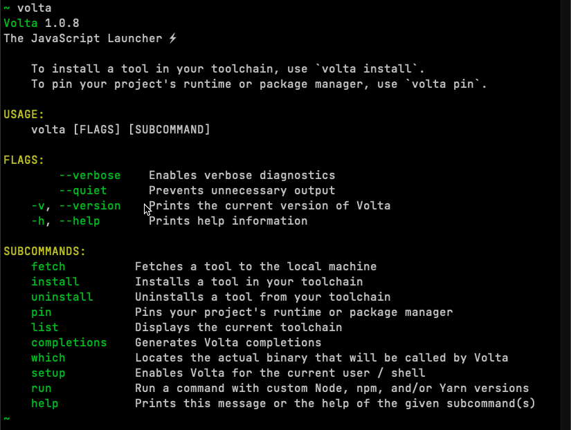
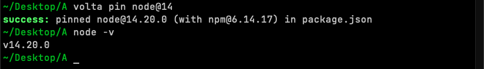
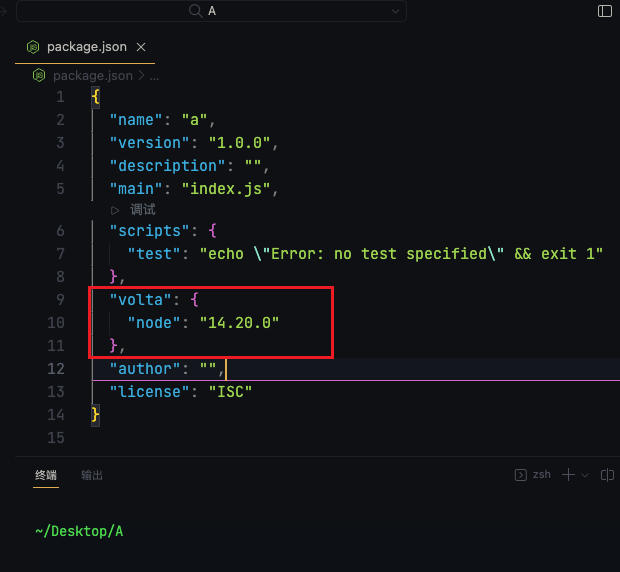
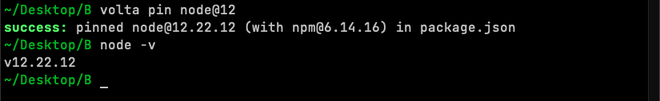
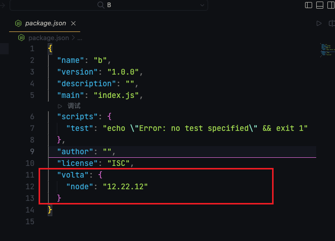
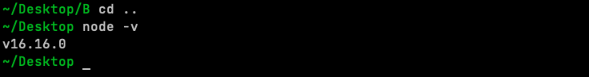

## Volta

[github](https://github.com/volta-cli/volta)
[文档](https://volta.sh/)

不同项目依赖的 node 版本不同, 不同版本的依赖库可能要求的 node 版本也不同.
随着 node 的新版本发布, 新特性也越来越多, 依赖于 node 16 的工具也越来越多.

:::note 需求:
不用为了某个项目而手动切换 node. 我希望本地环境是 node 最新的 current 版本.但是各个项目拥有自己的 node 锁定版本.
:::

可以尝试一下 Volta ( 读音: [ˈvoʊltə] ) !

## 安装 (MacOS 环境示例)

```bash
curl https://get.volta.sh | bash
```

安装成功如图


然后重启一下终端

```bash
volta
```



## 全局安装管理 node

在全局安装指定 node 版本

```bash
volta install node@16.16.0
```

或者指定 node 大版本

```bash
volta install node@16
```

## 锁定(隔离)项目 node

现在我电脑环境是 node@16.16.0

新建两个示例项目 A 和 B

:::note 需求
本机 node 是 16.16.0

在项目 A 指定 node 版本为 @14

在项目 B 指定 node 版本为 @12

彼此 node 互不影响
:::

使用 volta:

- 到项目 A 的根目录, `volta pin node@14`

  
  

- 到项目 B 的根目录, `volta pin node@12`

  
  

- 验证本地 node 版本

  

## 总结

- `install`: 安装 node 或者当前 node 版本下的一些工具,如 json-server 也可以的
- `fetch` : 不安装的情况下, 可以把可能会用到的 node 包下载到本地, 可以在离线环境下切换
- `pin` : 在项目内使用, 可以锁定当前项目指定的 node 版本

`更多命令见文档` : https://volta.sh/
