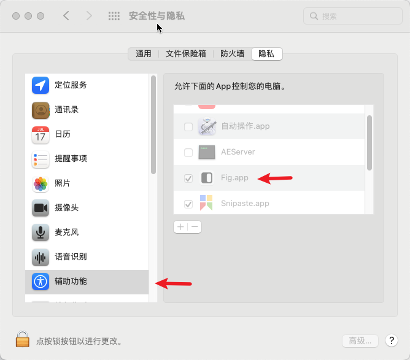

## Fig

- github: [withfig/autocomplete](https://github.com/withfig/autocomplete)
- doc : [fig.io](https://fig.io/)

> 目前仅支持 MacOS

## 安装 fig

- 可以选择下载安装包 .dmg
- 也可以选择使用 `brew install --cask fig`
- 完成安装后, app 启动台会出现 fig app 的图标
  
- 点击启动
- 引导用户开启辅助动能隐私权限
  
- 自动重启目前正默认使用的终端/手动重启

## 使用效果

