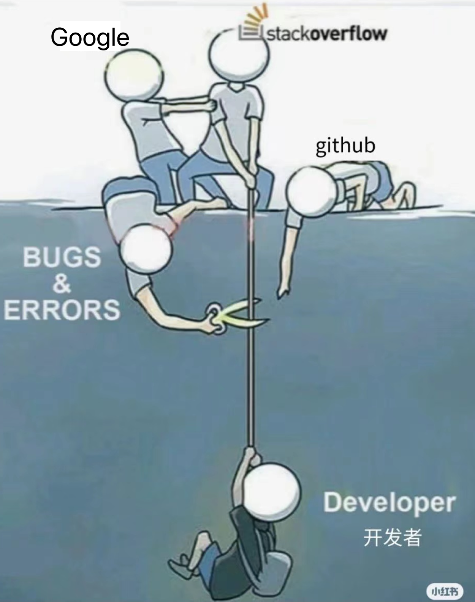

## 前景提要

<u>默认熟悉 js，html，css</u>

## 前端小灶

### 是什么?

> 两个阶段
>
> 初学者引导阶段，引导快速上手。引导式学习，目的在于上手，上手到工程实践需要一个过程，这个过程中主动思考和探索是艰难且必不可少的。
>
> 项目实践阶段，上手之后一起搭建和设计项目流程。讨论式，而非教学式。带着问题学习，拿着代码讨论。 "Talk is cheap, show me the code. -- Linus"
>
> > 分配项目课题实践 (如果效果好的话)

### 为什么?

> - react 学习需求。
>
> - 「听」比「看」理解知识更快。(文字 -> 大脑读一遍 -> 转化成声音 -> 记忆)
>
> - 目标导向：通过「前端小灶」得到使用 react 技术栈开发的能力。

### 怎么做?

> - 英语是必须，学会找翻译，学会技术领域的专业术语极其含义。
> - 每一节需要立即敲代码。
> - 比起学习的内容，学习的方法更为重要。前端内容纷繁多变，能够以不变应万变的方法是：会学习，能学会。

### 关于讨论问题

> 一般步骤分为:
>
> - 描述问题( 中文/英文 ) -> 表达能力和专业术语
> - 谷歌问题 -> 主动解决问题的行动力
> - 整理问题到 notion (笔记本) -> 好记性不如烂笔头
> - 最终讨论：「为什么」-> 「是不是」

### 关于 github

1. 了解如何翻阅 issues。
2. 了解信息源的获取。
3. 习惯多逛 github。。

### 关于 html

[体系化看看 HTML 标签, 还有多少没有了解?](https://julesblom.com/writing/html-elements)

### 关于 css

学会做摘抄和笔记，抱着：总有一天会用上的心态。

"学可以不术，但不能不博。--和坤"

### 关于 js

- 单线程的语言。
- 数组方法需要烂熟于心，最低要求得知道原生方法能做什么，忘记就查 mdn。
- 了解同步和异步，宏任务和微任务。 [轮询机制- 点击查看系列文章](https://dev.to/lydiahallie/series/3341Articles)

### 关于 React

- 用于构建用户界面的 JavaScript 库
- [中文官网](https://zh-hans.reactjs.org/)老旧，[英文官网](https://reactjs.org/)是论文天书，[beta 新官网](https://beta.reactjs.org/)比较易懂
- 前端框架设计思想引领者（ [Vue3 究竟好在哪里？（和 React Hook 的详细对比）](https://zhuanlan.zhihu.com/p/133819602)）。
- “生态的价值可能已经越过 react 自身价值” -- 某文章
- react 没有固定配方，放弃权威，保持客观，跟上时代。

### 关于「前端小灶」本身

- 自驱力是核心。
- 动手比动脑重要。
- 提前思考, 带着问题学习。
- 最终的目标：共赢进步。
