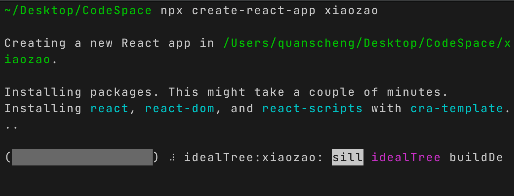
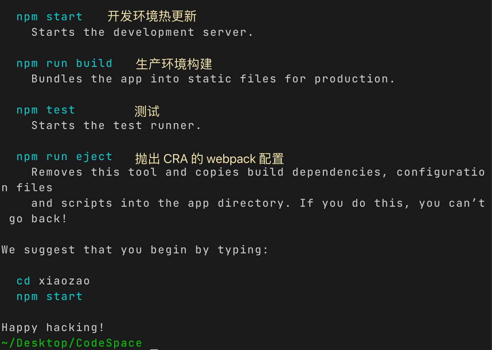
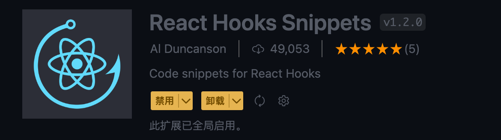
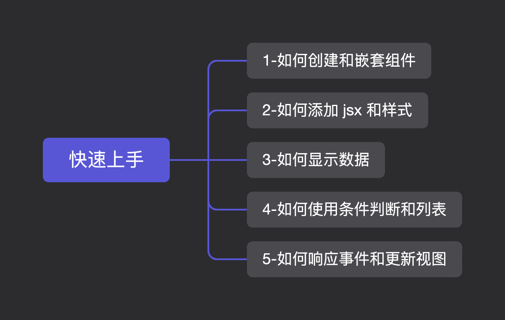
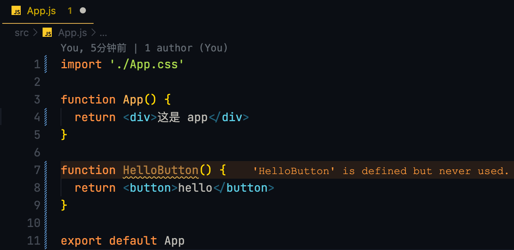
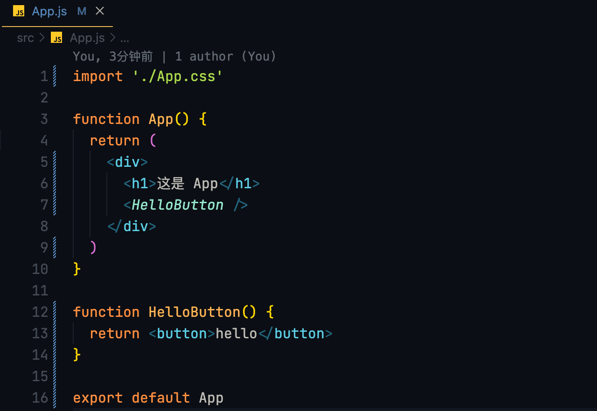
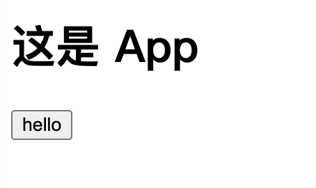
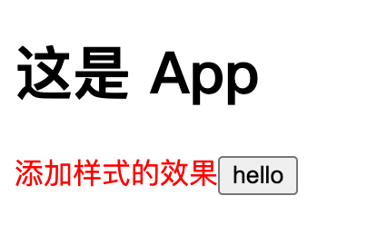
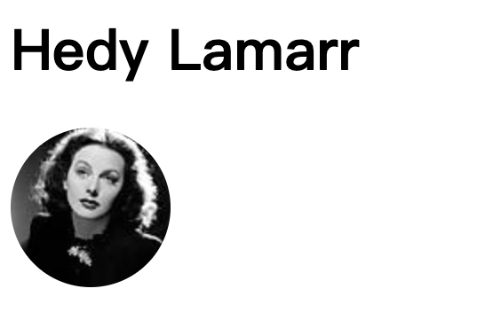

## 创建新项目方式

以下方式都可以

- 使用官方推荐的 CRA ([create-react-app](https://create-react-app.dev/))
- 使用 [Vite](https://cn.vitejs.dev/)
- 其他了解: [Parcel](https://parceljs.org/getting-started/webapp/)，[esbuild](https://esbuild.github.io/)，[swc.](https://swc.rs/)

:::info 仓库

https://github.com/quanscheng/xiaozao

:::

---


##  CRA

```bash
npx create-react-app 项目名字
```

 ###  执行效果与说明如下: 





:::info 试一试

用上述方法创建一个自己的项目

:::


### 代码结构

先看一下默认的项目结构

```bash
.
├── README.md
├── package-lock.json			
├── package.json
├── public  # 静态文件
│   ├── favicon.ico
│   ├── index.html
│   ├── logo192.png
│   ├── logo512.png
│   ├── manifest.json
│   └── robots.txt
└── src								
    ├── App.css
    ├── App.js # 默认给的最小案例
    ├── App.test.js
    ├── index.css
    ├── index.js # 入口文件
    ├── logo.svg
    ├── reportWebVitals.js
    └── setupTests.js
```

:::info 试一试

`npm start` 启动项目

可以尝试更改`App.js` 看看热更新效果

:::


### 最小化开始项目

为了减少最开始的「为什么」，我们可以把暂时不需要的文件去掉，同时移除相应的依赖，保持我们学习开始的代码最简化

```bash
└── src
    ├── App.css
    ├── App.js
    └── index.js
```

---


## VSCode 插件




---


## 快速开始



### 创建组件和嵌套组件

```jsx title="函数即组件"
function HelloButton() { 
  return <button>hello</button>
}
// 对比一下跟普通函数的区别?
```



:::info 

已经成功声明了自定义组件 `HelloButton` ，我们需要将它嵌套进`App` 组件中，让它成功渲染

:::



效果如图:



:::info 在上述的操作中, 你应该注意到

- React组件都是大写字母开头。
- 原生 html 标签都是小写字母开头

::: 

### 使用 jsx 和添加样式

:::info JSX

- JSX 比 HTML 更严格，所有标签都必须闭合（比如:`<br/>`）。
- 每个组件有且只能返回一个 jsx。
- 必须将组件嵌套在共享父级中（比如：`<App/>`）。
- 如果不想渲染额外的 `div` 可以使用 `<></>` 包裹。

:::

比如上面例子 App 组件还可以下面这样写:

```jsx
function App() {
  return (
    <>
      <h1>这是 App</h1>
      <HelloButton />
    </>
  )
}
```

:::info 添加样式

在 React 中，你指定一个 CSS 类`className`。它的工作方式与 HTML[`class`](https://developer.mozilla.org/en-US/docs/Web/HTML/Global_attributes/class)属性相同。

:::

```jsx
function App() {
  return (
    <>
      <h1>这是 App</h1>
      <span className='subTitle'>添加样式的效果</span>
      <HelloButton />
    </>
  )
}
// App.css
.subTitle {
  color: red;
}
```




### 显示数据

jsx 里面渲染你获取的变量值的写法是: `{ js变量 }` 

```jsx
import './App.css'

const user = {
  name: 'Hedy Lamarr',
  imageUrl: 'https://i.imgur.com/yXOvdOSs.jpg',
  imageSize: 90,
}

function App() {
  return (
    <>
      <h1>{user.name}</h1>
      
    </>
  )
}

export default App

// App.css
.avatar{
  border-radius: 50%;
}
```



:::info

`style` 属性，同行内样式的作用，jsx 的行内样式写法与 html 不同的是：

- 接受一个 css 对象类型
- 原生 css 中所有`-` 符号连接的属性名，都必须去掉`-`多个单词采用小驼峰写法
- 场景: 当样式需要根据 js 变量进行动态变化时候, 可以使用行内样式

:::


### 条件渲染

```jsx
function App() {
  const hasLearned = true

  // if (hasLearned) {
  //   return <h1>张无忌学会了乾坤大挪移一人爆锤六大门派</h1>
  // } else {
  //   return <h1>张无忌偶遇山猴获九阳神功逼出寒毒</h1>
  // }

  let JSXMarkup = null

  if (hasLearned) {
    JSXMarkup = <h1>张无忌学会了乾坤大挪移一人爆锤六大门派</h1>
  } else {
    JSXMarkup = <h1>张无忌偶遇山猴获九阳神功逼出寒毒</h1>
  }
  
  return <>{JSXMarkup}</>
}
```

###  列表渲染

```jsx
const names = ['张无忌', '周芷若', '杨不悔', '小昭', '赵敏']

function App() {
  const list = names.map((name, i) => (
    <li
      key={i}
      style={{ color: i === names.length - 1 ? 'red' : '' }}
    >
      {name}
    </li>
  ))

  return <ul>{list}</ul>
}
```


### 响应事件

```jsx
function App() {
  const click = () => {
    alert('点我了')
  }

  return <button onClick={click}>点我</button>
}
```

:::info 关于react事件名

其实 react 里面的事件名就是为了与原生事件区分，都是采用小驼峰的形式。

:::

### 更新画面

我们用上面条件渲染的例子，由我们来控制条件。此时需要更新视图。

```jsx
import { useState } from 'react'

function App() {
  // const hasLearned = true
  const [hasLearned, setHasLearned] = useState(false)
  const handleChange = () => setHasLearned(!hasLearned)

  let JSXMarkup = null

  if (hasLearned) {
    JSXMarkup = <h1>张无忌学会了乾坤大挪移一人爆锤六大门派</h1>
  } else {
    JSXMarkup = <h1>张无忌偶遇山猴获九阳神功逼出寒毒</h1>
  }

  return (
    <>
      <button onClick={handleChange}>切换武功状态</button>
      {JSXMarkup}
    </>
  )
}
```

:::info 简单了解hook

- `use` 开头的函数 -- hook。
- `useState` 是 react 内置的 hook。
- 调用`useState` 返回一个数组：
  - 第一个元素是状态(state)：负责渲染视图的状态 ；
  - 第二个事更新状态的方法(setState)：负责更新对应的状态值。
- `setState((上一次的值)=>返回值)` 传入一个回调，入参是状态上一次的值，出参是更新的实际的值。
- hooks 只能在组件内使用。
- hooks 只能在组件内顶层调用，在条件语句/循环中调用。

:::